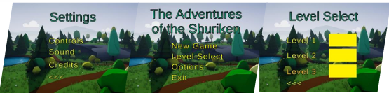
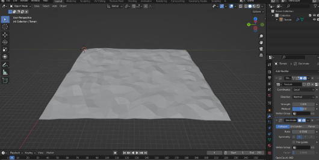
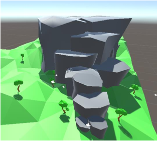
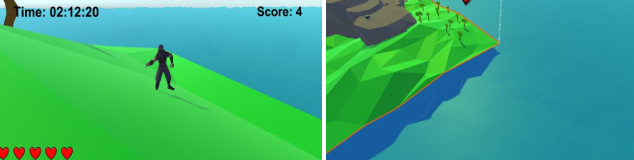
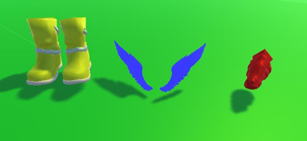
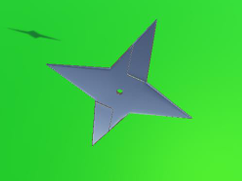
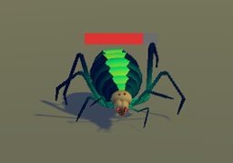

# Adventures of the Shuriken 🎮
A 3D platformer game developed in Unity, designed and implemented as part of my BSc Final Year Project.

### 🧠 Key Features
- Three fully playable levels with progressive difficulty  
- Custom 3D models designed in Maya and Blender  
- C# scripts for AI enemy behaviour and power-up mechanics  
- Animation controllers for player/enemy movement  
- Physics-based interactions and collision systems  

### 🧰 Technologies Used
Unity | Unreal Engine | C# | Blender | Autodesk Maya | Git | Gantt Charts (Project Planning)

### 🏆 Grade: 1st Class
Solo developed as part of my BSc in Multimedia Technology and Design at the University of Kent.

📚 Link to my portfolio showcasing the devlopment and gameplay - https://drive.google.com/file/d/1lk9wuTGTaLTnBNV4KQCDVpycvHmPqryX/view?usp=drive_link

📚 Link to my project report - https://drive.google.com/file/d/1lVp5ULnVYRTpoBvyRPqBPT6kizQieowQ/view?usp=drive_link

## 🖼️ Screenshots & Media

Here’s a visual preview of the *Adventures of the Shuriken* 3D platformer project.  

### Main Menu

### Audio Settings

### Low Poly Terrain

### Prototype Level

### In-game Sea

### Power-ups

### Environment Assets

### Collectables

### HealthBar

### Character Model

### Spider Enemy

🎥 For a full gameplay demo, you can watch the video here:  
[Watch on YouTube](https://youtu.be/YOUR_VIDEO_ID)

